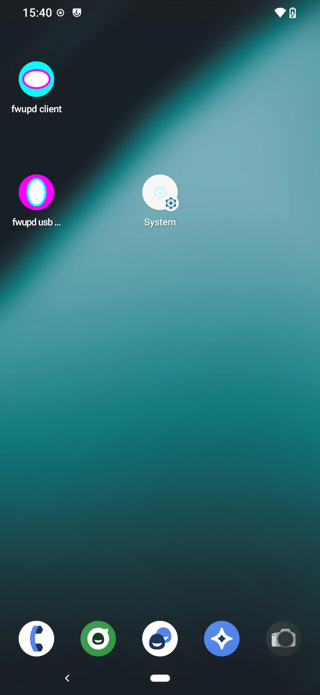
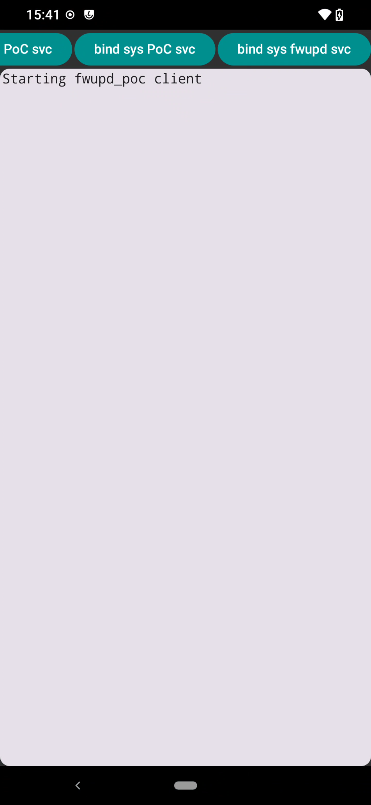
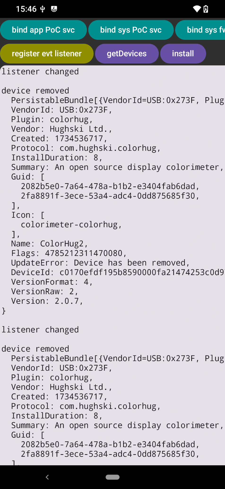
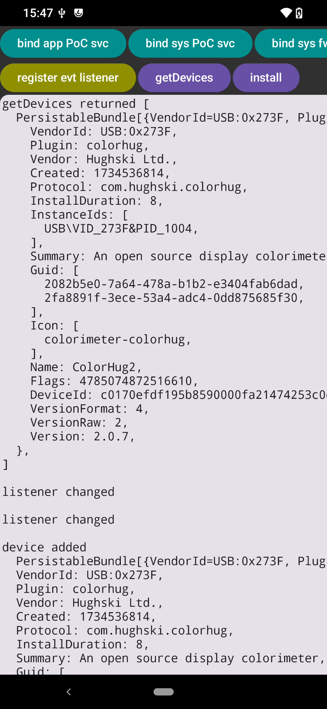
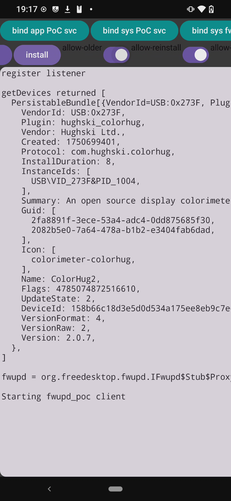
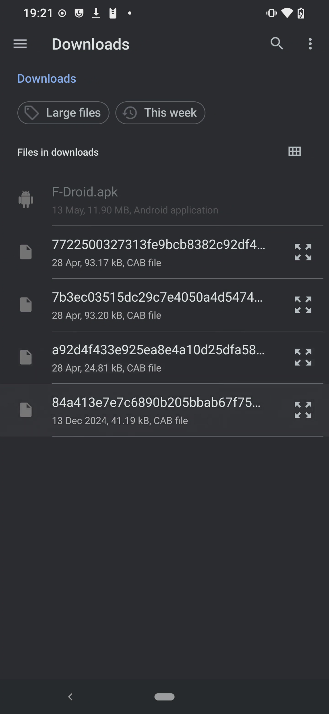
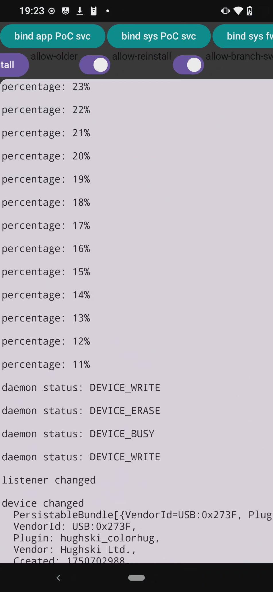

# fwupd Android test app

An Android client to test interaction with the [`fwupd-binder`](https://github.com/fwupd/fwupd/tree/hughsie/binder) daemon.

See also [BUILD_ANDROID_NDK.md](https://github.com/fwupd/fwupd/blob/hughsie/binder/BUILD_ANDROID_NDK.md) in the binder branch of fwupd.

## Setup

First clone the fwupd [binder branch](https://github.com/fwupd/fwupd/pull/7395).
This contains:
* `gparcelable.c` which is used by the daemon to marshal GVariants into android parcels
* `IFwupd.aidl` & `IFwupdEventListener.aidl` which is used by the client defines and defines the fwupd binder interface

```bash
git clone https://github.com/fwupd/fwupd.git
cd fwupd
git pull origin pull/7395/head:hughsie/binder
git checkout hughsie/binder
```

### platform libbinder_ndk

The NDK version of `libbinder_ndk.so` doesn't contain service management symbols.

```bash
adb pull /system/lib64/libbinder_ndk.so ./lib_ndk/
```

Headers for the `libbinder_ndk.so` platform components can be found here:
https://cs.android.com/android/platform/superproject/main/+/main:frameworks/native/libs/binder/ndk/include_platform/

## Service/daemon

These are instructions for installing a test binder service and not for fwupd itself

### Build

Setup the NDK path in `android_aarch64_cross_file.ini`

```ini
[constants]
ndk_path = '/opt/android/android-ndk-r27/'
```

then run

```bash
meson setup -Dfwupd-path=../fwupd --cross-file android_aarch64_cross_file.ini --prefix=/data/fwupd-poc-binder _android_build
meson install -C _android_build --destdir=$(pwd)/_android_dist
```

### Installation

In order to be executed the executable must be placed in a directory that isn't mounted with `noexec`.

The devices `/` or `/system/` partition can be read/write:
```bash
adb -d root
adb -d shell mount -oremount,rw /
```

push the installation to the device with

```bash
../fwupd/contrib/android/adb-push-sync.sh _android_dist/data/fwupd-poc-binder/ /data/fwupd-poc-binder/
```

and run with
```bash
./adb_fwupd_env.sh fwupd-poc-binder
```

Then you can check if the service has been registered with
```
adb -d shell service list | grep fwupd
```

Patches and `meson.build` files for subprojects are in `subprojects/packagefiles`

## Client

In order for a client to connect to the binder service we must either tag the executable to allow it to expose a service or switch off selinux:

```bash
adb -d shell setenforce 'permissive'
```

The selinux error looks is:
```
SELinux : avc:  denied  { find } for pid=24772 uid=10177 name=fwupd_poc scontext=u:r:untrusted_app:s0:c177,c256,c512,c768 tcontext=u:object_r:default_android_service:s0 tclass=service_manager permissive=0
```

I have tried tagging the executable with `chcon u:object_r:default_android_service:s0 fwupd-poc-binder` but it doesn't fix it.

The clients output can be viewed with `adb -d logcat` or filtered with:
```bash
adb -d logcat 'fwupd_poc_service:*' 'fwupd_client:*' 'op.fwupd.client:*' 'AndroidRuntime:*' 'TransactionExecutor:*' 'SELinux:*' 'DEBUG:*' '*:S'
```

### Installation

The android client app can be installed by running the following in the `client/` directory:

```bash
FWUPD_AIDL_PATH="${FWUPD_REPO_PATH}/contrib/android/aidl" ./gradlew installDebug
```

### Running

#### Interacting with fwupd

| Open "fwupd client" | Press "bind sys fwupd svc" to connect to fwupd service | Press "register evt listener" and plug/unplug device | Press "getDevices" to request device list from fwupd |
|-|-|-|-|
|  |  |  |  |

#### Installing a firmware

To test firmware installation make sure you've already connected to the daemon, registered an event listener, verified that fwupd has recognised the device you're wanting to install the firmware on and have the firmware you want to install available in the android file system.

| Set toggles for reinstall etc. and press install | Select the correct firmware for your device | Behold! An update! |
|-|-|-|
|  |  |  |

## Appendix

This repo also contains C Android services to test and validate libgbinders ability to expose an Android service that can be consumed by an Android client using aidl bindings.

The app package also exposes an app that useful as a more generic testbed for other tasks related to fwupd android such as exploring the `USBManager` service.

The client also functions as a testbed for gparcelable for marshalling GVariants into android Parcels.

### SimpleFd service

`simple-fd-svc` is a service implemented using the platform version `libbinder_ndk.so` without using libgbinder.

This is due to problems I had transferring file descriptors over libgbinder.

The instructions for running it are the same as the previously mentioned service.
